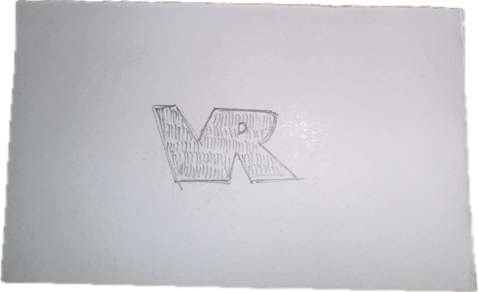
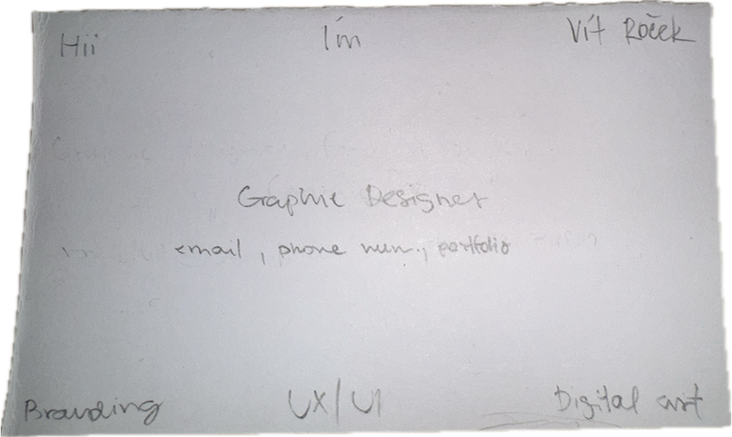

[english-for-designers](../README.md)
# Business card 💼📇

This project is a rework of my business card created as part of a class assignment. 
The task was to translate a visual sketch into a written handshake, short introduction or tagline that clearly communicates who I am, what I do, what I’m like, and how to contact me. 
The focus was on clarity, conciseness, and readability.

My business card from class

*Hand-drawn*

My second try

*Hand-drawn / front side*

*Hand drawn / back side*
