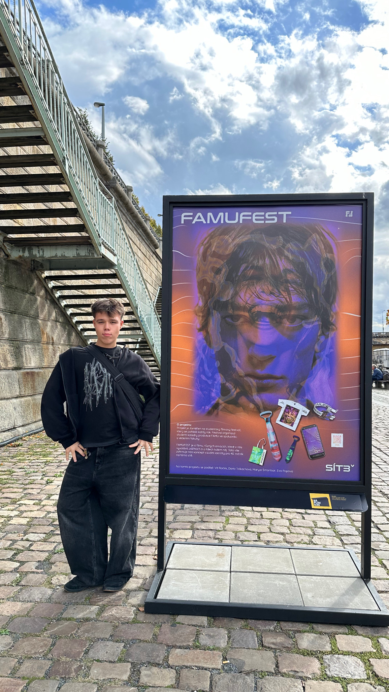

[english-for-designers](../README.md)

# This is me 👼🌟
Hi, I’m Vít Roček, a graphic designer who works with branding, UX/UI and digital art.  
I create visual systems and digital experiences that are clear, easy to use, and quietly expressive. I enjoy turning complex ideas into simple, smooth experiences.  

I started design in high school, where I learned to think about form, function, and user experience. Since then, I’ve grown by working on real projects, collaborating with others, and studying design at university.  

A key moment for me was designing the visual identity for the 40th Famufest, themed “Networks.” It was our first university group project. Our work reached the finals and was shown to the festival’s official jury. Even though we didn’t win, the school displayed it at the university exhibition on Náplavka. This experience showed me how design can reach real people and strengthened my passion for creating work that is thoughtful and meaningful.  

Today, I aim to make work that balances clarity with personality. I enjoy building identities that feel alive, interfaces that feel easy, and digital art that sparks emotion. I like projects that challenge me, let me experiment, and create solutions that truly help people.  

My long-term goal is to work on projects that mix culture, technology, and storytelling–design that is not just seen but felt.  
