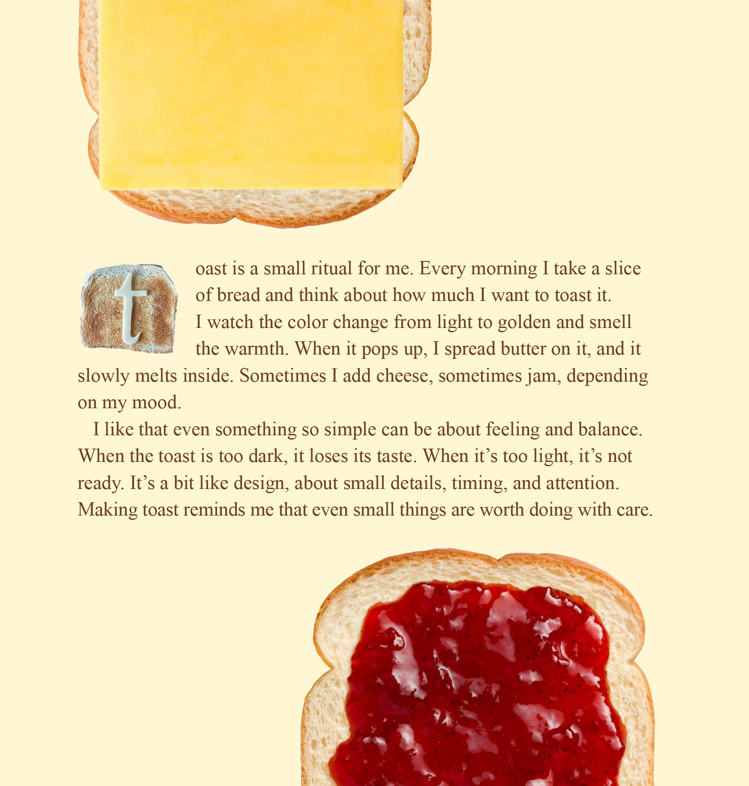

# [english-for-designers](README.md)
# Alt Text

Some other text I wrote.

- [Preview Image](#the-art-of-toasting)

### The Art of Toasting
A reflection connecting the ritual of making toast with graphic design about balance, timing, and thoughtful attention.


### More visually pleasing second concept

work in progress...
