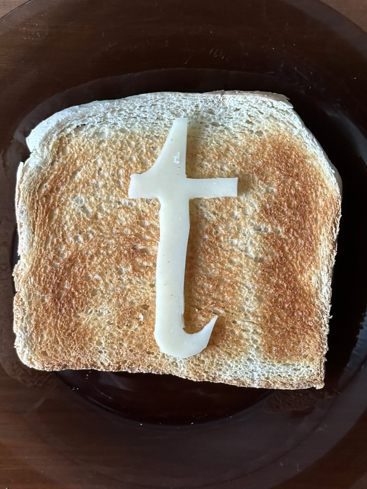

[english-for-designers](../README.md)
# Designing a Bespoke Character

For my first assignment, I created an original letterform based on a character from the modern English alphabet.  

I chose one letter and reworked it in my own style. I picked the lowercase “t” from Times New Roman and recreated it by cutting the shape out of a slice of cheese and placing it on a piece of toast. I made the piece using mixed, hands-on techniques, with no AI tools. The focus was fully on my own craft and interpretation.  

The final result is a one-of-a-kind character that reflects my personal visual approach. 🍞🧀

