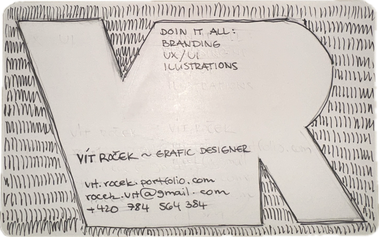

[english-for-designers](../README.md)
# Business card 💼📇

This project is a rework of my business card created as part of a class assignment. 
The task was to translate a visual sketch into a written handshake, short introduction or tagline that clearly communicates who I am, what I do, what I’m like, and how to contact me. 
The focus was on clarity, conciseness, and readability.

My business card from class  
  

This was my first attempt, where I played with my initials to create an interesting composition.

*Vít Roček – Graphic Designer*  
- *vit.rocek.portfolio.com*  
- *rocekt.vit@gmail.com*  
- *+420 784 564 384*  
- *Doing it all: Branding, UX/UI, Ilustrations*  

---

My second try  
  
I used my initials as a logo on the front of the business card.  

  
I feel much better about this one, the composition is cleaner and more confident.  

*Hii I´m Vít Roček*
- *Graphic Designer*
- *email, phone number, portfolio*
- *Branding, UX/UI, Digital Art*

