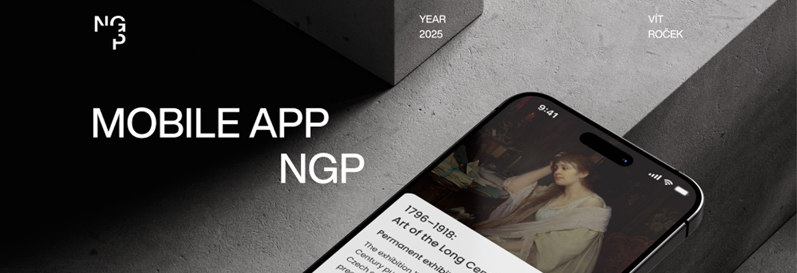
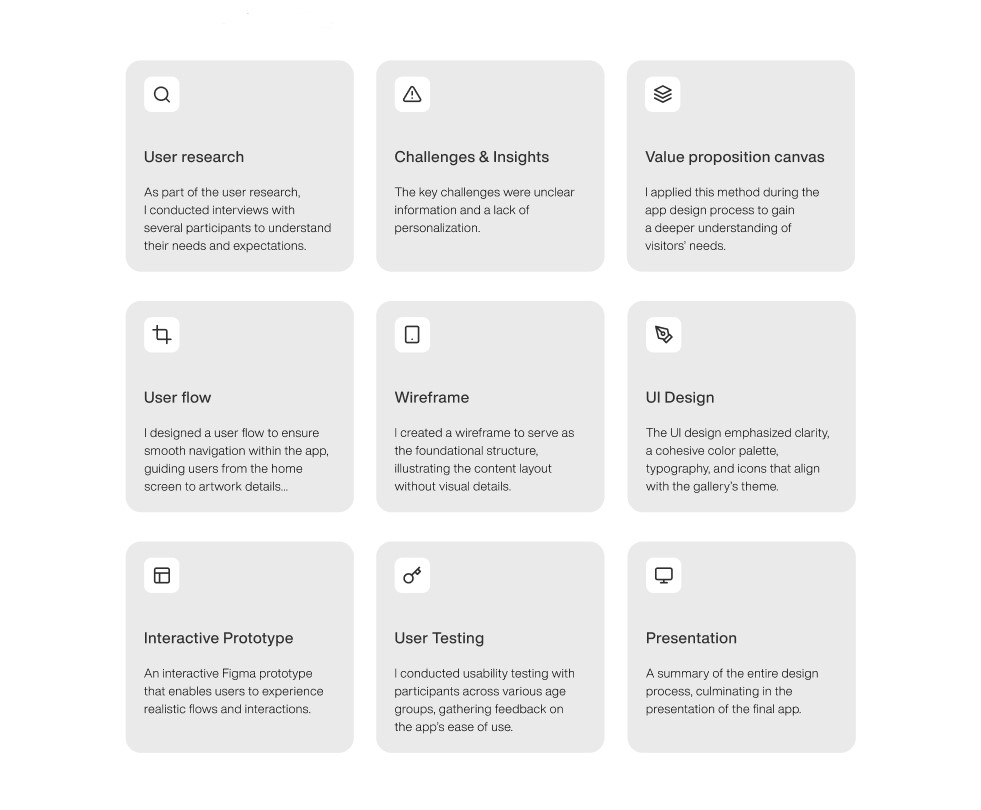
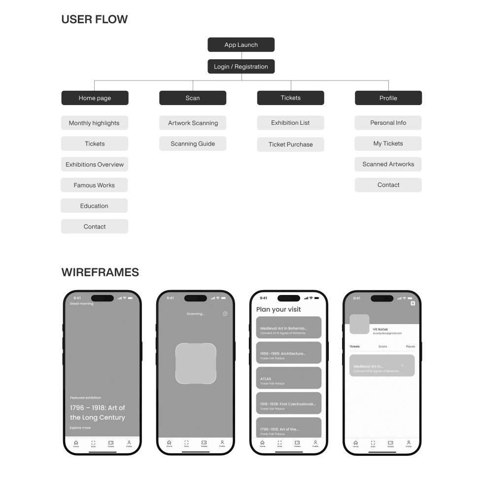
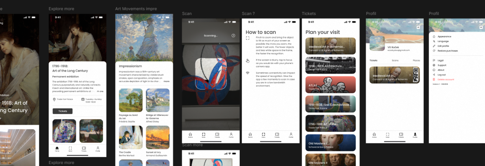
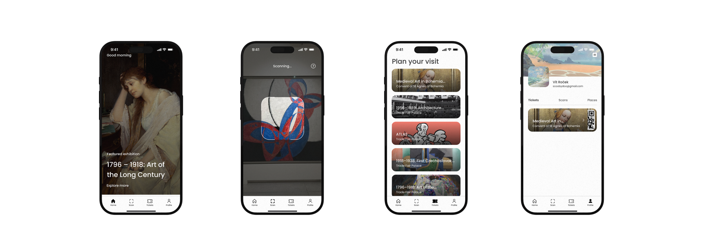

[english-for-designers](../README.md)

# App for NGP – Case Study 🖼️📱  
  
## My Role & Project Brief

> “Designing a mobile app for a cultural institution sounds simple. It isn’t...”

This project focused on three core elements:  
- **Navigation** across multiple exhibitions
- **Easy** ticket purchase
- **Personalized** visitor experience

  
*I worked end-to-end. I handled research, UX/UI design, prototyping, and testing. I turned a school brief into a full product concept.* 

---

## The Core Problem Or Opportunity
> “The goal was not to fix a broken system. It was to add a new layer to the gallery experience.”

Gallery visits can feel inspiring. But they are often limited by the space.  
Information lives on walls.  
Access depends on distance, time, and crowd size.  
The format does not work for everyone.  

I focused on three main opportunities:  
1. **Access to information**  
  Users can view artwork details without relying on wall labels

3. **Ease of use**  
   Simple ticket purchase and a clear overview of current exhibitions  

4. **Extended experience**  
  Users can scan artworks, explore movements, and return to content later

The goal was simple.
Create a mobile app that supports the visit and makes it more **flexible** and **inclusive**.

---

## Understanding Reality

Before designing, I needed to see how people actually behave in galleries.

I approached the problems:

- Researching visitor behavior
- Reviewing existing apps
- Building the information architecture

> “Users don’t want more information. They want the right information at the right time.”

This insight shifted the direction. It wasn’t about adding features. It was about **making things more accessible**.

---

## Design Process

> “I moved from structure to interaction.”

  

First, I built clarity:

- User research and key insights – understanding users’ needs
- Value proposition canvas – defining what the app should deliver
- User flow, wireframes, UI design – structuring the experience

  

Then, I focused on interaction:

- Interactive prototype in Figma
- User testing with real users, colleagues and friends
- Final presentation of the concept

 
 

Three priorities guided every decision:

- **Speed** — users get information fast
- **Clarity** — no overload 
- **Continuity** — connect physical and digital space

---

## What Worked, What Didn’t

Some features worked well:

- **In-app tickets** made entry simple
- **Artwork scanning** gave instant context
- **Personal gallery** let users save artworks

Other areas remained unfinished:

| Area | Status | Insight |
|------|--------|--------|
| Personalization | Partial | Saving works isn’t enough without deeper recommendations |
| Social features | Not solved | Sharing could extend the experience beyond the visit |
| Visitor analytics | Not solved | Data could improve both UX and exhibitions |

This is a strong base. But it is not a full system yet.

---

## The Experience in Practice

| | |
|---|---|
|  |  |

A mobile interface that connects physical space with digital interaction.

---

## The Impact

The final outcome wasn’t just a prototype, it was a vision of a better gallery experience.

Visitors could:

- Access tickets instantly  
- Learn about artworks in context  
- Build a personal collection during their visit  

> “The visit shifts from passive viewing to active exploration.”

I also shared this concept with the National Gallery Prague. I offered to walk them through the idea in person if it resonated, but they didn’t get back to me.

---

## What I Learned

Designing for cultural spaces is a balance.  
Too much information overwhelms.  
Too little creates distance.  

Key lessons:
- Simplicity beats completeness  
- Navigation shapes the experience
- Testing shows what design alone cannot  

Working solo helped me improve fast. It forced me to make clear decisions at every step.  

