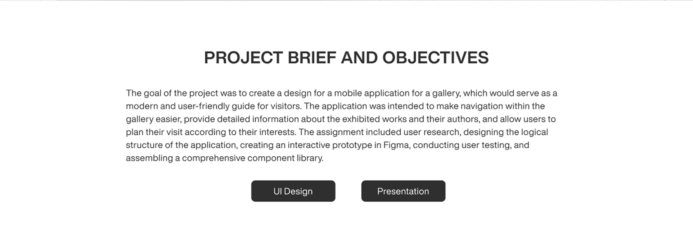
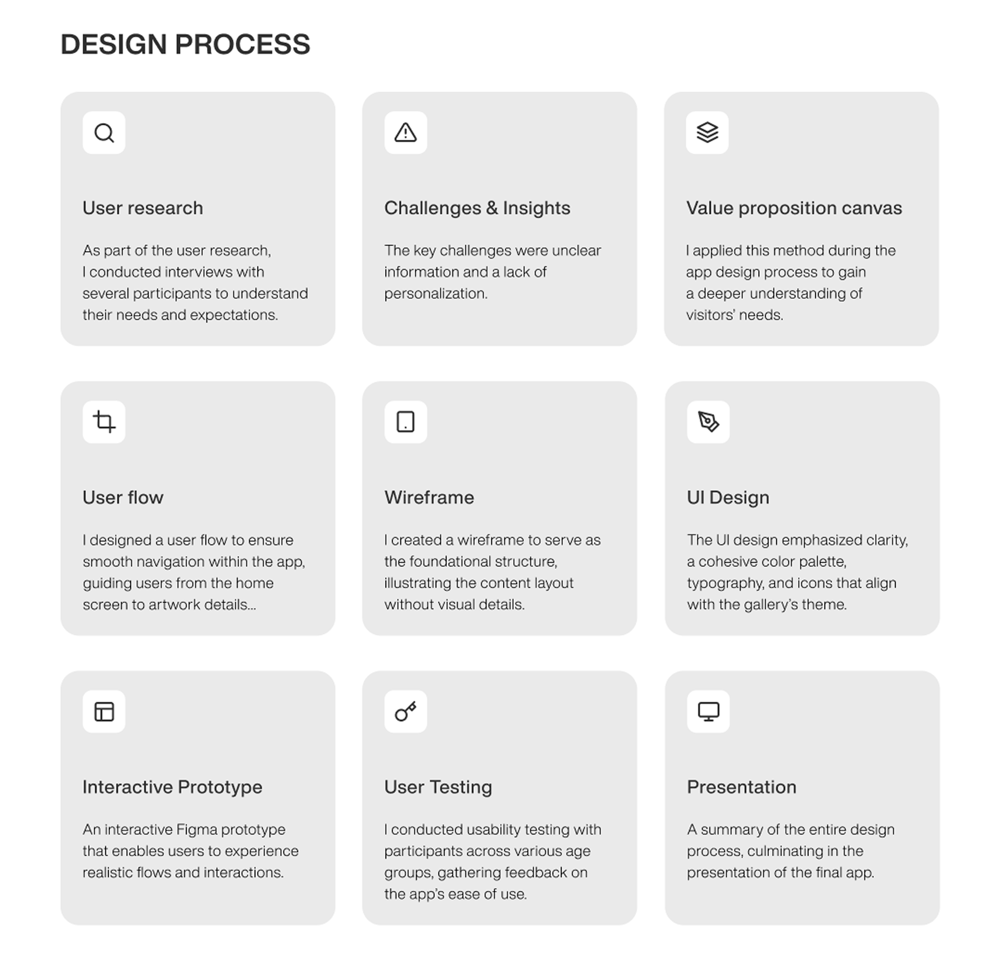
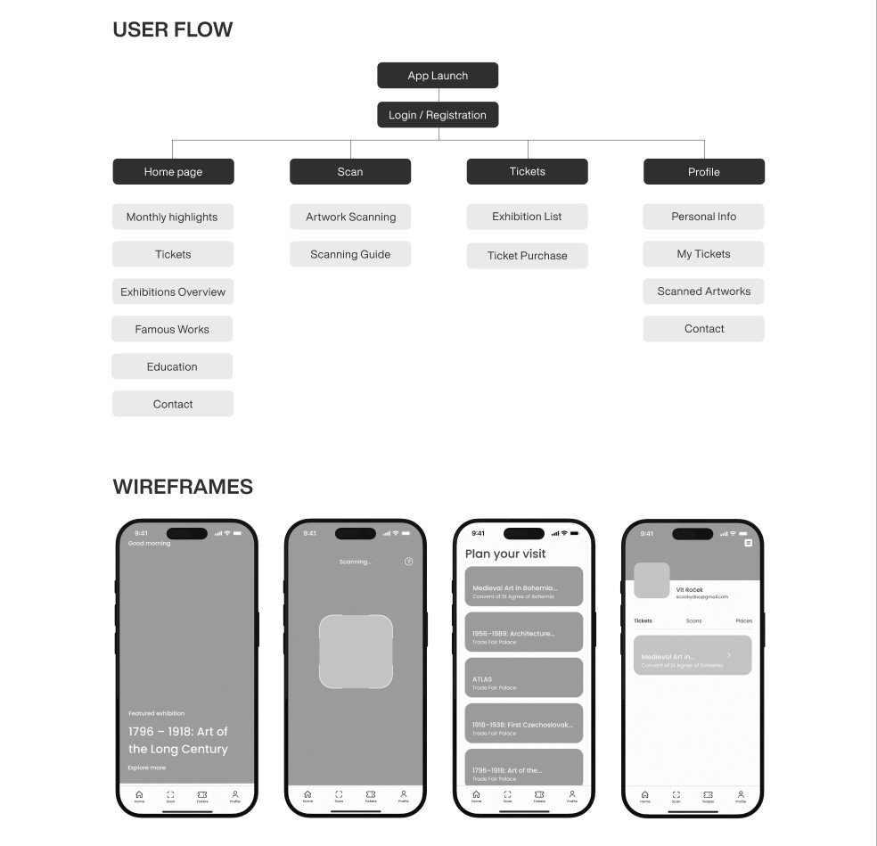
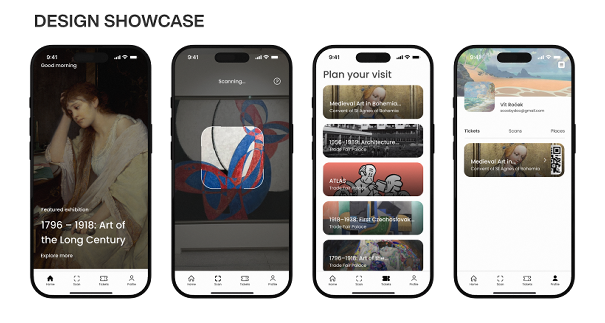

[english-for-designers](../README.md)

# Case Study - App for NGP🖼️📱  
 
## Project Brief

> “Designing a mobile app for a cultural institution sounds simple, until you step inside the complexity of a gallery experience...”

This project focused on three core elements:  
- **Navigation** through many current exhibitions
- **Understanding** artworks beyond short wall labels  
- **Personalization** of each visitor’s journey

  
*I worked end-to-end handling **research, UX / UI, prototyping, and testing** turning a school brief into a fully realized product concept.* 

---

## The Core Problem Or Opportunity
> “The goal wasn’t to fix a broken system, but to introduce a new, more accessible layer to the gallery experience.”

Visiting a gallery can be inspiring, but often limited by what’s physically available in the space.

Information is tied to walls, distance, and crowd density.  
Access depends on where you stand, how much time you have, and how comfortable the format is.

My concept focused on three key opportunities:

1. **Access to information**  
   View details about artworks and artists without relying on physical labels  

2. **Ease of use**  
   Simple ticket purchase and a clear overview of current exhibitions  

3. **Extended experience**  
   Scan artworks, explore artistic movements, and revisit content anytime  

The idea was to create a mobile app that complements the physical visit making it more flexible, inclusive, and self-directed.

---

## Understanding Reality

Before designing anything, I needed to understand how people actually behave in galleries, not how we think they do.

I approached the problems:

- Researching visitor behavior in galleries and museums
- Analyzing existing gallery and museum apps  
- Mapping out structure through information architecture  

> “Users don’t want more information, they want the right information at the right moment.”

This insight shifted the direction. It wasn’t about adding features. It was about **making things more accessible**.

---

## Design Process

> “The design process moved from structure to interaction.”  

  

First came clarity:

- User research, problems, and insights – understanding users’ needs
- Value proposition canvas – defining what the app should deliver
- User flow, wireframes, UI design – structuring the experience

  

Then came interaction:

- Interactive prototype – built in Figma
- User testing – validating decisions with real users
- Final presentation – showcasing the app

 

Three priorities guided every decision:

- **Speed** — access information instantly  
- **Clarity** — avoid overwhelming the user  
- **Continuity** — connect the physical and digital experience  

---

## Constraints and Trade-offs

Not everything could be solved—and that shaped the outcome as much as the ideas did.

> “The challenge wasn’t what to add, but what to leave out.”

Key limitations included:

- Avoiding feature overload in a content-heavy environment  
- Limited time for advanced personalization  
- No scope for social or community features  

These constraints forced sharper decisions—and a more focused product.

---

## What Worked, What Didn’t

Some features clearly delivered value:

- **In-app ticket storage** simplified entry  
- **Artwork scanning** provided instant context  
- **Personal gallery** let users save and revisit pieces  

Other areas remained unfinished:

| Area | Status | Insight |
|------|--------|--------|
| Personalization | Partial | Saving works isn’t enough without deeper recommendations |
| Social features | Not solved | Sharing could extend the experience beyond the visit |
| Visitor analytics | Not solved | Data could improve both UX and exhibitions |

The result was a strong foundation—but not a complete ecosystem.

---

## The Experience in Practice

A mobile interface designed to connect physical exploration with digital interaction.

---

## The Impact

The final outcome wasn’t just a prototype—it was a vision of a better gallery experience.

Visitors could:

- Access tickets instantly  
- Learn about artworks in context  
- Build a personal collection during their visit  

> “The experience shifted from passive viewing to active exploration.”

The project was also shared with the National Gallery Prague as a forward-looking concept.

---

## What I Learned

Designing for cultural spaces is a balancing act.

Too much information overwhelms. Too little disconnects.

Three key lessons shaped my approach:

- **Simplicity beats completeness** in content-heavy environments  
- **Navigation is experience**, especially in physical-digital hybrids  
- **Early testing reveals what design alone cannot**  

Working solo across the entire process strengthened not just my skills—but my ability to make decisions with clarity and intent.
