[english-for-designers](../README.md)
# Storytelling

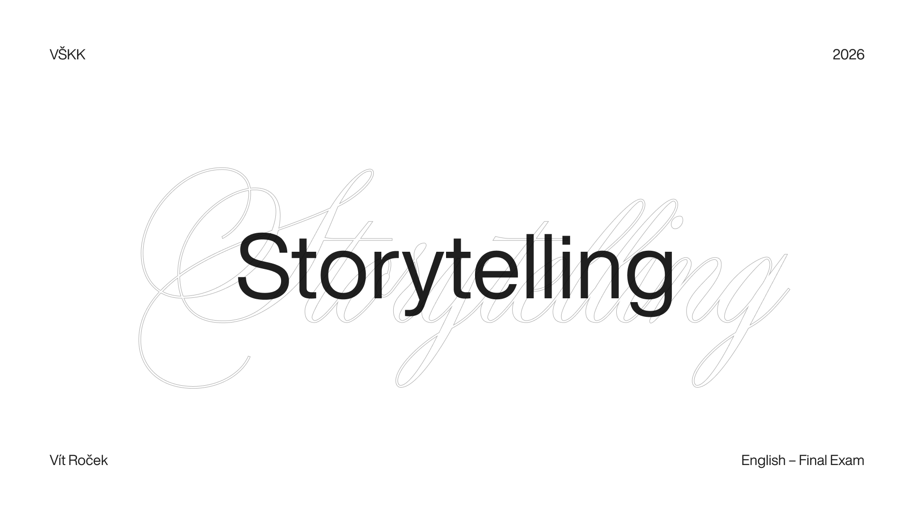  
*Hi everyone! Please welcome to my storytelling.*  

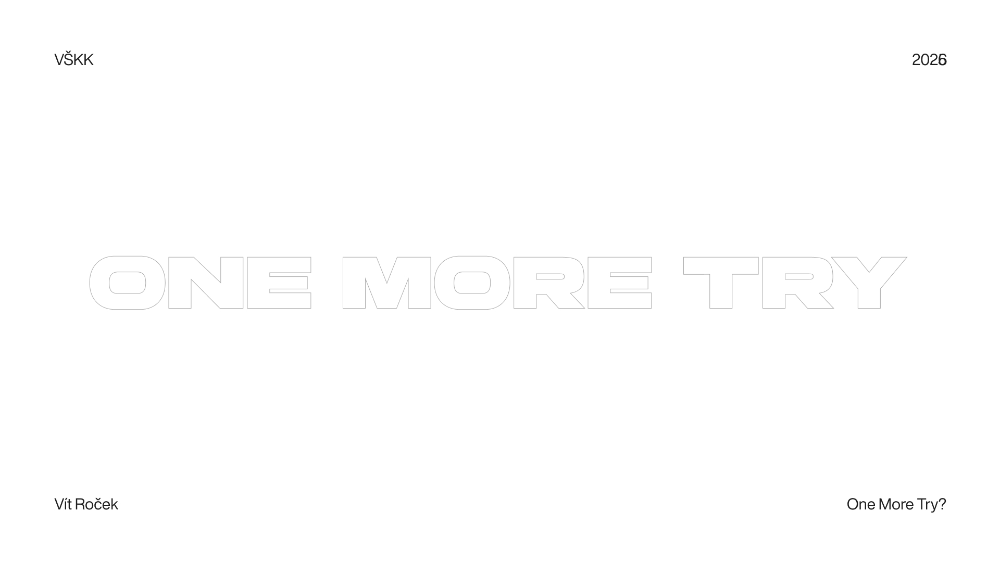  
*My story is called One More Try.  
One.*

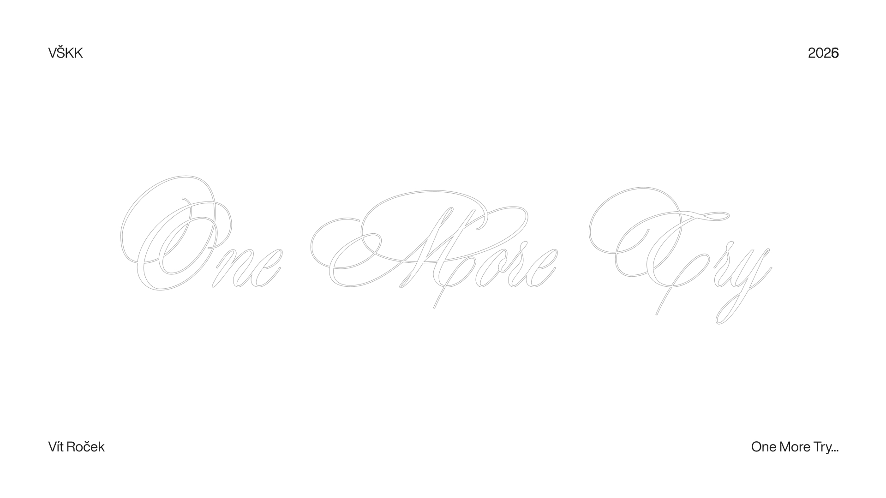  
*More.*

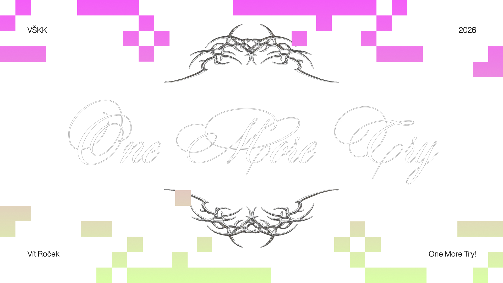  
*Try.*  

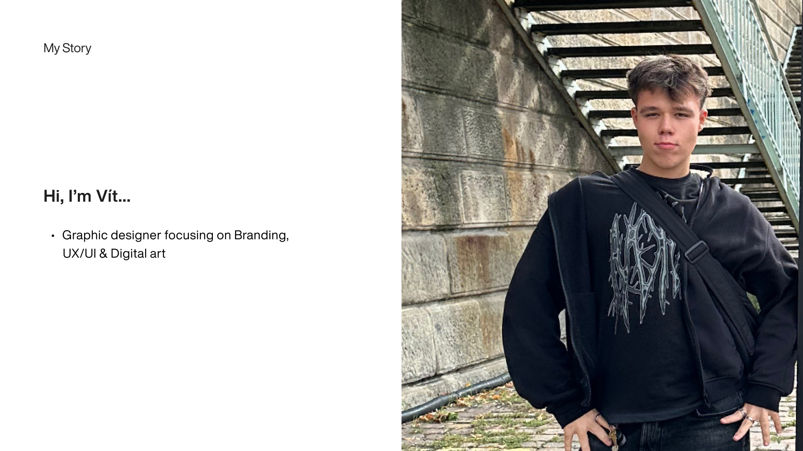
*I'm Vít Roček - a graphic designer focused on branding, UX/UI, and digital art.*  

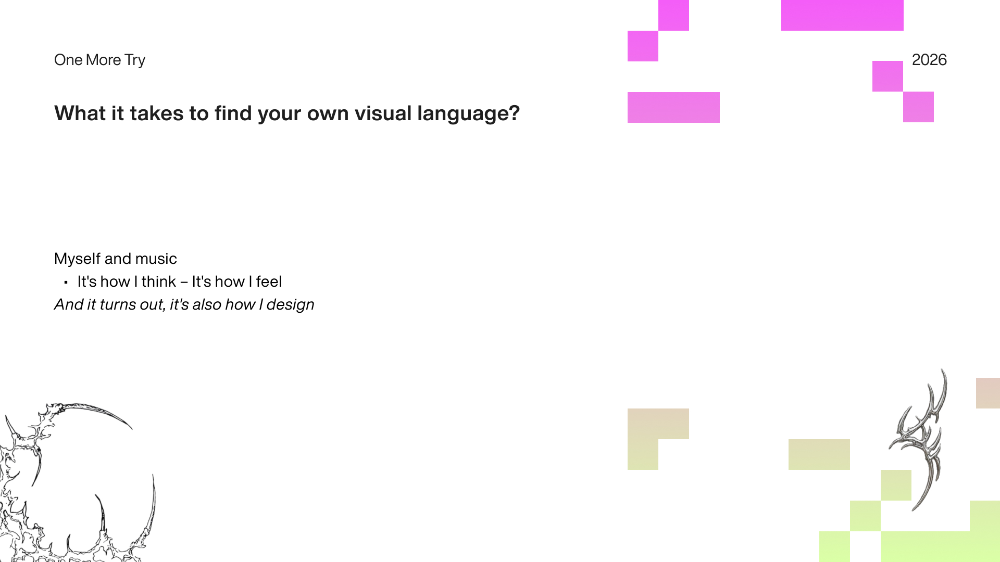  
*And I'm here to talk to you about what it takes to find your own visual language.*

*But before we get there, let me tell you something about myself.I can't imagine a single day without music. It's not background noise. It's not a playlist I put on while I work. It's how I think. It's how I feel. It's how I make sense of the world around me. And it turns out - it's also how I design.*  
*This is my story about a visual identity built from scratch. About many directions and decisons that went nowhere. And one breakthrough I found in the last place I expected.*   

*But first - let me take you back to where it all started.*

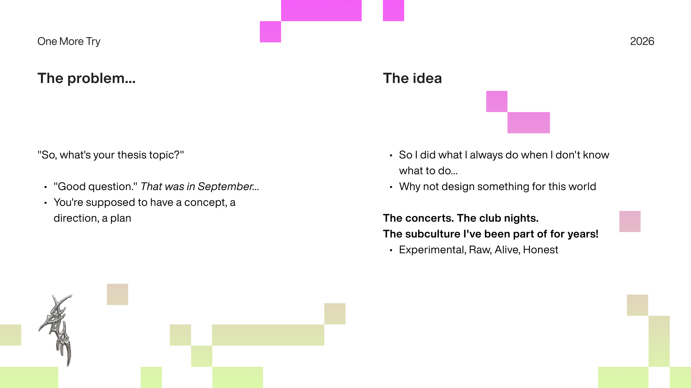  
*A year ago, I had no idea what I wanted to do for my thesis.*

*My supervisor asked me: **"So, what's your thesis topic?"** I said: **"Good question."** That was September. It was not a good answer...*  
*You're supposed to have a concept. A direction. A plan. Everyone around you seems to know exactly what they're doing. And you're sitting there thinking - I have nothing.*   

*So I did what I always do when I don't know what to do.*  
*I put on my headphones on.*   
*And I started listening.*   

*Than it hit me. Why not design something for this world? The world I already live in every day. The concerts. The club nights. The subculture I've been part of for years. Not a mass open-air festival. Not a corporate music brand. Something that feels like the music itself. **Experimental. Raw. Alive. Honest.***

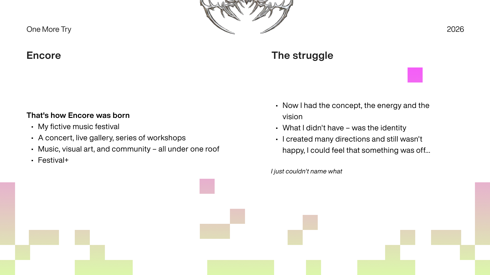  
***That's how Encore was born. My fictive music festival.***

*The name comes from two places. First - it's my favorite song, by an artist called Shygirl. Second - the word itself. An additional performance, prompted by enthusiastic audience demand. That felt right. A festival that keeps giving. That earns its next moment.*  
*Encore isn't just a music festival. It's three things at once. A concert. A live gallery. A series of workshops. Music, visual art, and community - all under one roof.* 

***And the key*** - these three things aren't separate. They feed each other. The music informs the visuals. The visuals shape the lineup. The workshops build the community that makes the whole thing matter.*  
*I called it **Festival+**, because it's more than a festival. It's a platform. A space for creativity, self-expression, and experiment. Open to everyone.*

*Now I had the concept. I had the energy. I had the vision.*

***What I didn't have - was the identity.***  
*And that's where things got hard.*   
*Here's something I think about a lot. Graphic design and music seem like completely different languages. One is visual. One is sound. But when you look closer - they do the same thing. They take something invisible. A feeling. An idea. An identity. And they make it real. They give it shape. They make it something you can hold onto.*  
*That's what Encore needed. A visual language that could carry all of that weight. The energy of the music. The openness of the community. The rawness of the subculture. And I had no idea how to do it. 
So I started designing. And I kept designing.*   
*I created many directions and still wasn't happy with the outcome. I could feel that something was off. I just couldn't name what.*   
*Each time I showed my supervisor, he told me the same thing: keep going. Even when he liked what I showed him - he could see I wasn't satisfied. And he respected that. He didn't tell me to stop and pick something. He told me to trust myself and continue. That mattered more than I expected.*   

*But I was stuck. Really stuck.*   
*That feeling - that's art block. And if you've ever been there, you know how heavy it is. You're not stuck because you lack talent. You're stuck because you care too much to settle. Every designer I know has been there. And nobody talks about it enough...*

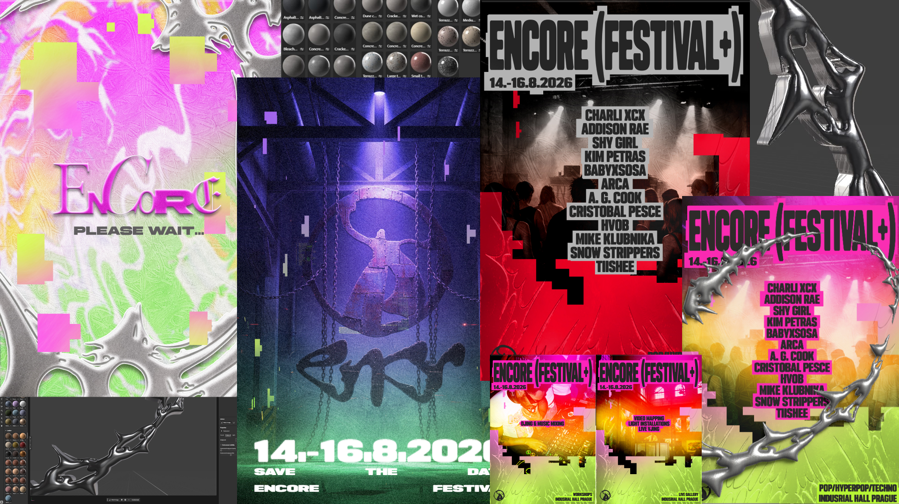  
*My design concepts and ideas.*

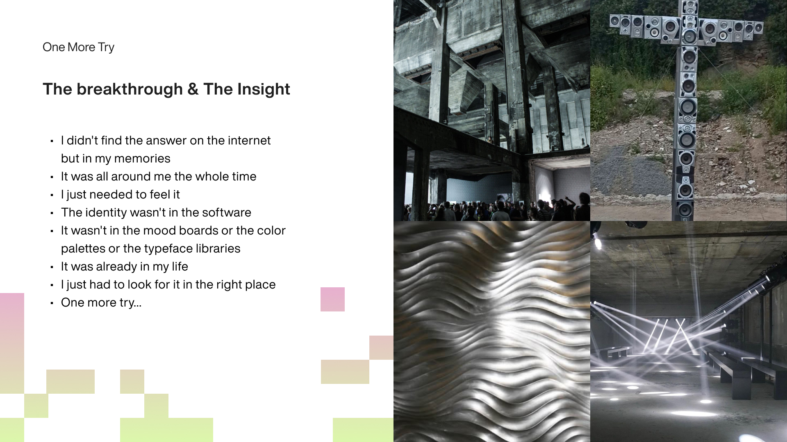  
*I didn't find the answer on the internet.*  
***I found it in my memories.** On my phone. It was all around me the whole time.*  
*One evening I stopped trying to design. I just started scrolling through photos from nights out with my friends. Concerts. Club nights. Random moments at 2am in places that felt like home. And I put on the music. I just needed to feel it.* 

*My friends were there too - not as designers, not as critics. Just as people who knew me. I showed them what I was working on. And they said: "This one. This feels like you."*   
***That was it.***  

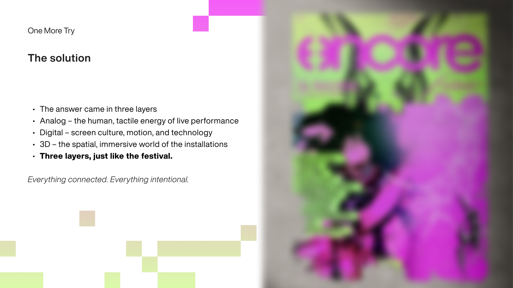  
*So I went back to the screen. One more try.*

*The answer came in three layers.*  
***Analog. Digital. 3D.***  
***Analog*** - the human, tactile energy of live performance. The handmade. The imperfect. The real.*   
***Digital** - the screen culture, motion, and technology of the visual program. Sharp, fluid, alive on screen.*   
***3D** - the spatial, immersive world of the installations. The environment itself as part of the identity.*

*Three layers. Just like the festival. Music, gallery, workshops. Everything connected. Everything intentional.*

*Together they create something that feels alive. Not just a logo. Not just a poster. A visual world you can step into. And for the first time — I was proud of what I made. Not because it was perfect.* ***Because it was mine.***

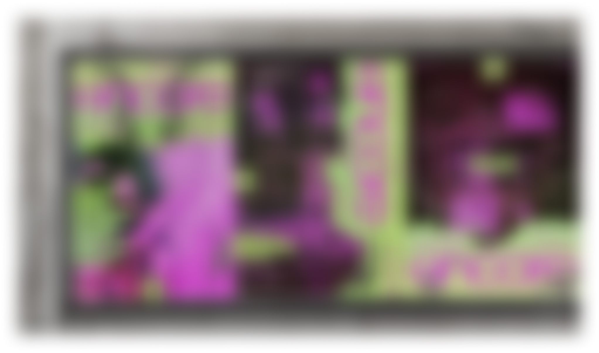    
*Teaser of my final design.*

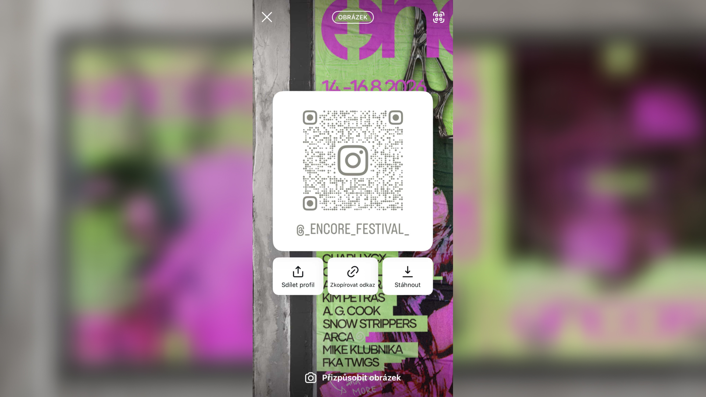    
*Invitation for the audience to follow my festival instagram profile.*

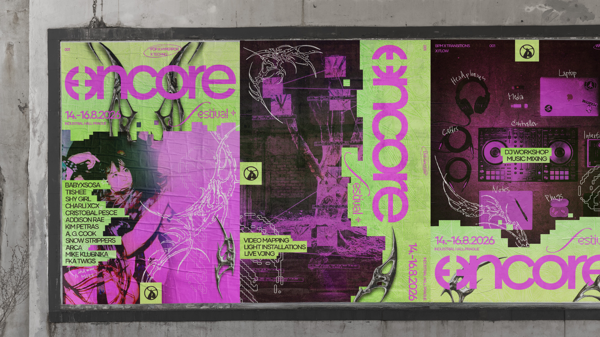  
*My final design.*

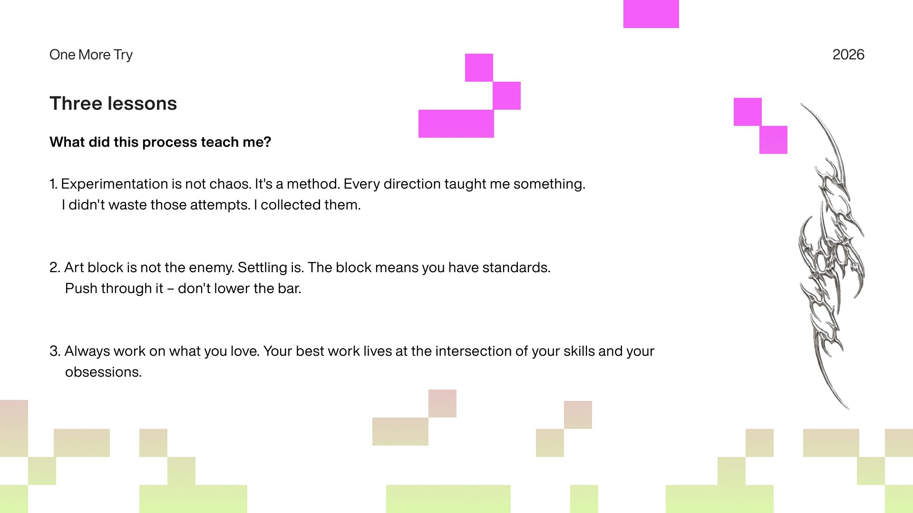  
*So what did this process teach me?*    

***Three things.*** 

*One: ***Experimentation*** is not chaos. It's a method. Every direction taught me something I couldn't have learned any other way. I didn't waste those attempts. I collected them. They were all necessary steps to get to the final one.*     

*Two: **Art block** is not the enemy. Settling is. The block means you have standards. It means you know the difference between good enough and actually good. Push through it - don't lower the bar.*     

*Three: **Always work on what you love.** Music runs through my life every single day. When I finally designed for that world - the world I already lived in - everything clicked. Your best work lives at the intersection of your skills and your obsessions. Find that place. Stay there. Don't let anyone tell you it's not serious enough.* 

 

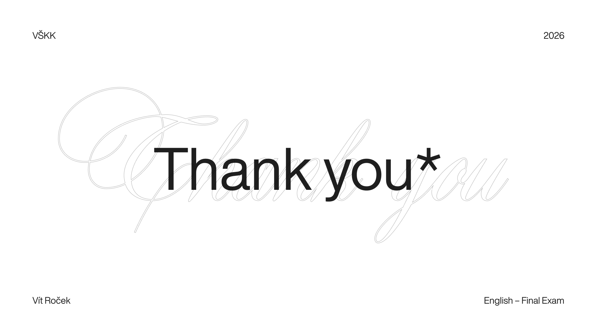  
*And maybe that's what finding your visual language really means.*    
*It's not a style. It's not a color palette. It's not a typeface.*     
*It's the moment your work finally sounds like you.*    
***This is that moment.***     
***This is Encore.***     
*Thank you.*  
